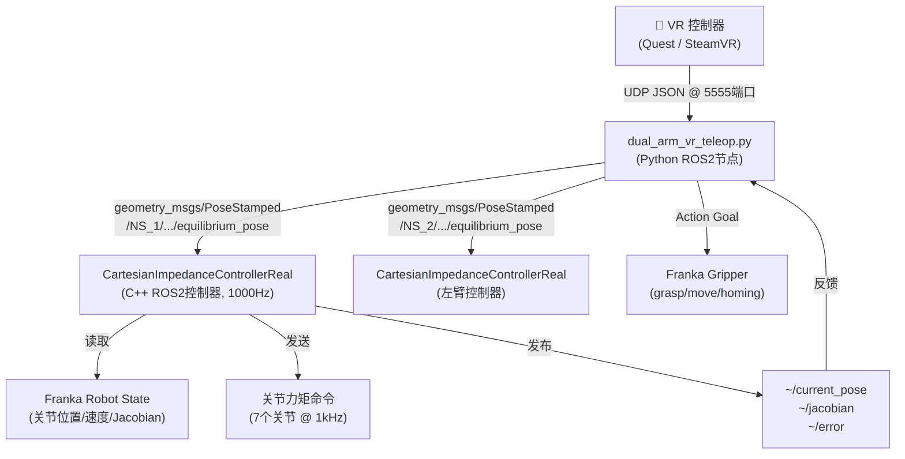

# OpenArm 项目架构解析：franka_controllers_real

## 核心架构
这是一个基于 **ROS 2** 的 **Franka 机械臂实时控制系统**，专为真实机器人设计，采用“阻抗控制 + 增量式 VR 遥操作”的技术方案。

## 1. 系统数据流

## 2. 核心组件解析

### A. 笛卡尔阻抗控制器 (C++, 1000Hz)
运行在实时线程中的控制核心，每个周期执行以下逻辑：
1. **状态更新**：获取关节位置 $q$、速度 $dq$、雅可比矩阵 $J$ 和 Coriolis 力。
2. **目标滤波**：对目标位姿进行低通滤波：$p_d = \alpha \cdot p_{target} + (1-\alpha) \cdot p_d$。
3. **力矩计算**：
   - 任务空间力矩：$\tau_{task} = J^T (-K \cdot e - D \cdot J \cdot dq - K_i \cdot \int e)$
   - 零空间力矩：$\tau_{null} = (I - J^T \cdot J^\dagger)(K_n \cdot q_{err})$
   - 总力矩：$\tau = \tau_{task} + \tau_{null} + \tau_{coriolis}$
4. **安全保护**：执行力矩限幅（$\Delta\tau \le 1.0 \text{ Nm}$/周期）和误差截断（$\pm 0.1 \text{ m}$）。

### B. VR 遥操作逻辑 (Python)
采用**增量式映射**算法：
- **握下 Grip**：捕捉起始位姿（VR 与机器人）。
- **持续握住**：计算相对于起始位的位移和旋转增量，并叠加到机器人的起始位姿上。
- **松开 Grip**：机器人停止跟随，冻结当前位置。

## 3. 按键映射

| VR 按键 | 动作 |
| :--- | :--- |
| `Grip` (右手) | 右臂跟随运动 |
| `Grip` (左手) | 左臂跟随运动 |
| `Trigger` | 切换夹爪开合 |
| `A`/`B` | 触发回零或自定义逻辑 |

## 4. 关键设计哲学
- **安全性**：通过硬件级别的阻抗控制实现接触柔顺，并辅以严苛的误差截断。
- **直觉性**：增量映射解决了 VR 空间与机械臂工作空间不一致的平移问题。
- **稳定性**：零空间刚度确保了在执行任务时，机械臂各关节不会轻易陷入奇异构型。

## 相关笔记
- [[OpenArm]]
- [[机械臂操作空间控制笔记]]
